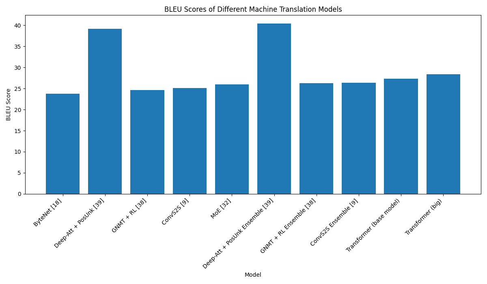
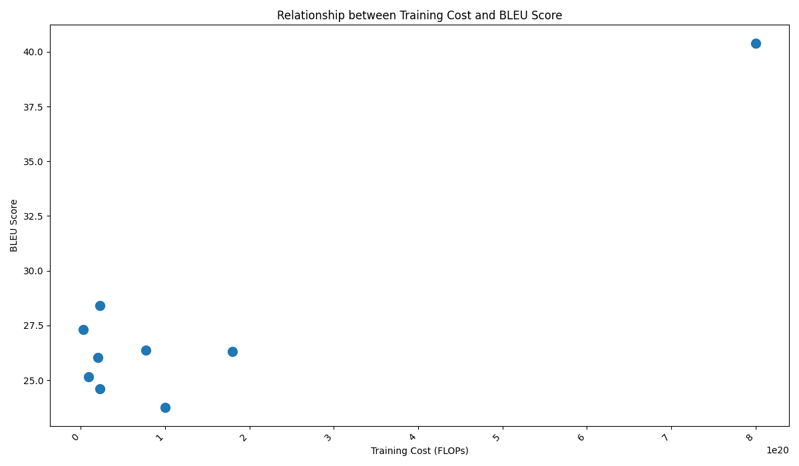

# Paper Agent SDK

A scientific research assistant system that leverages LLMs, LangChain, Neo4j, and dynamic visualization tools to automate literature search, data extraction, and analysis from research papers.

---

## Features
- **Automated paper search and ingestion** (arXiv, local, graph-based)
- **Structured table extraction** from scientific papers
- **Dynamic, LLM-driven data visualization** (bar, line, scatter, etc.)
- **Relationship and citation analysis** via knowledge graph
- **Contradiction/conflicting results analysis** between papers
- **Literature gap detection and future work suggestion**
- **CSV export of extracted data**
- **Robust error handling and fallback strategies**

---

## Quick Start
1. **Install dependencies:**
   ```bash
   pip install -r requirements.txt
   ```
2. **Set up Neo4j and vector DB as described in the docs.**
3. **Ingest papers** (see documentation for ingestion tools or API endpoints).
4. **Run the API server:**
    use Docker Compose:
   ```bash
   docker-compose up
   ```
5. **Interact with the system:**
   - Use the FastAPI docs at [http://localhost:8000/docs](http://localhost:8000/docs) to submit queries and view results.
   - Or build your own client/web UI to interact with the API.

---

## Docker Deployment

You can run the entire system (API, Neo4j, ChromaDB) using Docker Compose for easy setup and reproducibility.

1. **Build and start all services:**
   ```bash
   docker-compose build
   docker-compose up
   ```
   This will start:
   - The FastAPI web API (on port 8000)
   - Neo4j (on ports 7474/7687)
   - ChromaDB (on port 8002)

2. **Environment Variables:**
   - Set your credentials and API keys in a `.env` file or via environment variables:
     ```env
     NEO4J_URI=bolt://neo4j:7687
     NEO4J_USER=neo4j
     NEO4J_PASSWORD=password
     CHROMA_DB_PATH=http://chromadb:8000
     GOOGLE_API_KEY=your_google_api_key
     ```
   - The Docker Compose file will pass these to the containers.

3. **Artifacts and Data Persistence:**
   - Generated files (plots, CSVs) are saved in the `artifacts/` directory, which is mounted as a Docker volume for persistence.
   - Neo4j and ChromaDB data are also persisted via Docker volumes.

4. **Accessing the API:**
   - Visit [http://localhost:8000/docs](http://localhost:8000/docs) for the interactive API documentation.
   - Neo4j browser: [http://localhost:7474](http://localhost:7474)

---

## Example: Automated Visualization from Research Paper

This system can extract quantitative results from scientific papers and generate insightful visualizations automatically. Below is an example workflow you can run via the API:

**Example Prompt:**
```
I need to understand the performance of models in the 'Attention is All You Need' paper.
Please do the following:
1. Extract the main results table that includes BLEU scores and Training Cost.
2. From that data, create a visualization to **compare the BLEU scores** of the different models. Save it as 'bleu_comparison.png'.
3. From the same data, create another visualization to show the **relationship between Training Cost and BLEU score**. Save it as 'cost_vs_performance.png'.
4. Provide a final answer summarizing what the two charts show.
```

**How to Use:**
- Submit this prompt to the `/execute-query` endpoint via the API docs or your own client.
- The resulting visualizations and CSVs will be available in the `artifacts/` directory and can be downloaded via the `/artifacts/{filename}` endpoint.

**Resulting Visualizations:**

<p align="center">
  
  
</p>

<p align="center">
  <b>Left:</b> BLEU Scores of Different Machine Translation Models &nbsp;&nbsp;&nbsp; <b>Right:</b> Relationship between Training Cost and BLEU Score
</p>

---

## Architecture & Tooling
- See `agent_and_tools_overview.md` for a detailed breakdown of agents and tools.
- Modular, extensible, and robust for real-world research workflows.

---


